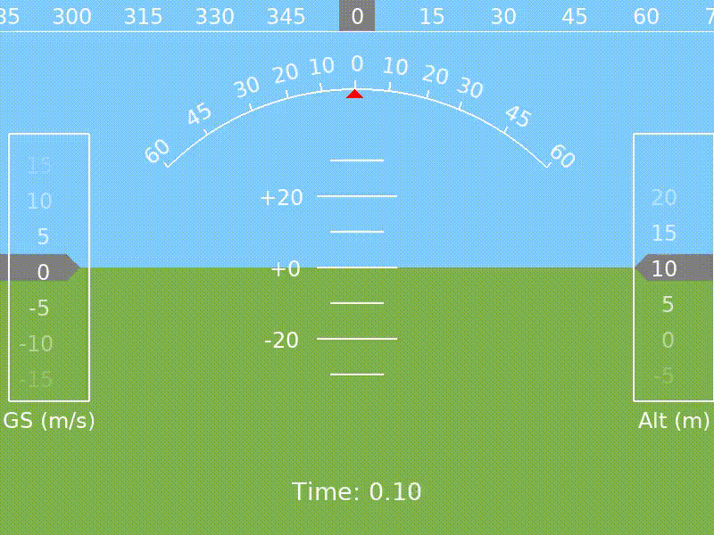

<br><br>

# gym-copter
OpenAI Gym environment for reinforcement learning with multicopters, as described 
[here](https://simondlevy.academic.wlu.edu/files/publications/LM2020_011_final_v2.pdf).

## Features:

* Pure Python / Cross-platform

* Uses realistic multirotor dynamics
([Bouabdallah et al. 2004](https://infoscience.epfl.ch/record/97532/files/325.pdf)) 

* Supports rendering via a Heads-Up Display (HUD) similar to Mission Planner / QGroundControl.

## Quickstart

```
% pip3 install gym
% python3 setup.py install
% python3 heuristic/lander2d.py
```
(On Linux you will probably need to run pip3 with <tt>sudo</tt>.)

You should see the copter land safely.

## Evolving a neural controller

The [NEAT](https://github.com/simondlevy/gym-copter/tree/master/neat)
sub-folder of this repository shows how you can use the NEAT algorithm to
evolve a neural controller for your copter.

## Supported environments

* **Lander2D-v0** 2D [LunarLander](https://gym.openai.com/envs/LunarLander-v2/)-style challenge

* **Lander3D-v0** 3D lander with reward proportional on proximity of touchdown to center

* **Hover2D-v0** reward for staying aloft and inside window, 2D version

* **Hover3D-v0** reward for staying aloft and inside window, 3D version

### Similar projects

[gym\_rotor](https://github.com/inkyusa/gym_rotor)

[GymFC](https://github.com/wil3/gymfc)

[How to Train Your Quadcopter](https://towardsdatascience.com/how-to-train-your-quadcopter-adventures-in-machine-learning-algorithms-e6ee5033fd61)
