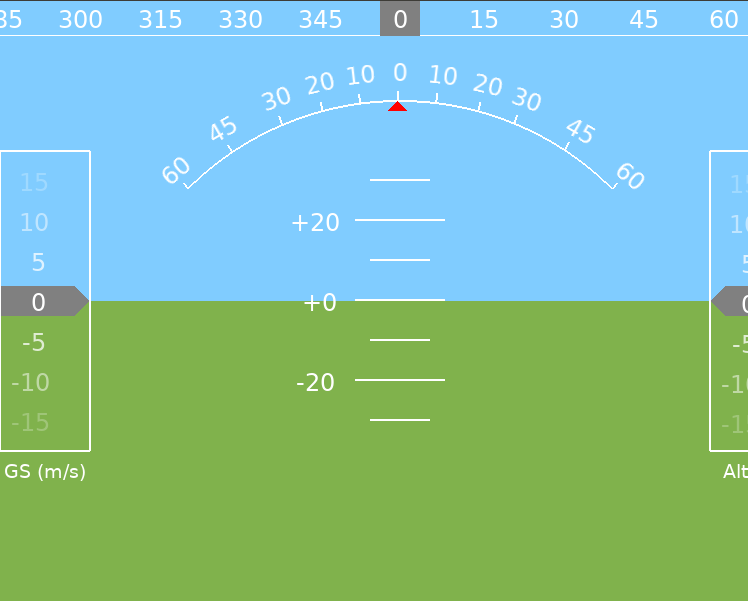

# gym-copter
Gym environment for reinforcement learning with multicopters.  

Features:

* Pure Python

* Cross-platform

* Uses realistic multirotor dynamics
([Bouabdallah et al. 2004](https://pdfs.semanticscholar.org/79ed/0df796997622e4de9b909e1c04d9febba3c7.pdf)) that can be
subclassed for a particular vehicle configuration (quad, hex, octo, etc.)

## Similar projects

[GymFC](https://github.com/wil3/gymfc)

[How to Train Your Quadcopter](https://towardsdatascience.com/how-to-train-your-quadcopter-adventures-in-machine-learning-algorithms-e6ee5033fd61)
