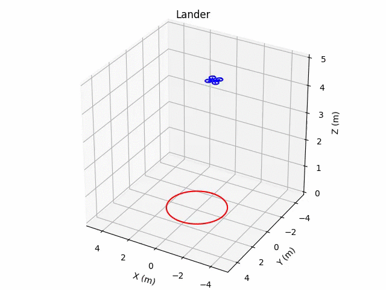

<br><br>

# gym-copter
Gym environment for reinforcement learning with multicopters.  

## Features:

* Pure Python / Cross-platform

* Uses realistic multirotor dynamics
([Bouabdallah et al. 2004](https://infoscience.epfl.ch/record/97532/files/325.pdf)) that can be
subclassed for a particular vehicle configuration (quad, hex, octo, etc.)

* Supports rendering via a Heads-Up Display (HUD) similar to Mission Planner / QGroundControl.

## Quickstart

```
% pip3 install gym
% python3 setup.py install
% python3 gym_copter/envs/lander2d.py
```
(On Linux you will probably have to run pip3 with <tt>sudo</tt>

You should see the copter land safely.

## Evolving a neural controller

Like some other [researchers](https://openai.com/blog/evolution-strategies/), I have switched focus recently
from Deep Reinforcement Learning (DRL) to Evolution Strategies (ES).  Current work (with Washington and 
Lee undergraduate student Coletta Fuller) focuses on applying the
[NEAT](https://www.cse.unr.edu/~sushil/class/gas/papers/NEAT.pdf) algorithm to
solve tasks in the GymCopter environment.

To try this out for yourself, you should install [neat-python](https://github.com/CodeReclaimers/neat-python).  Then 
do the following in the gym-copter repository:

```
% cd neat
% python3 evolve.py
```
This will run neat-python using the
[parallel fitness evaluator](https://neat-python.readthedocs.io/en/latest/module_summaries.html#parallel),
so you can take advantage of all the cores on your computer.

Once evolution finishes, you can test out your evolved network by doing:

```
% python3 test.py -i nets/<fitness>.dat
```

where ```<fitness>``` is the fitness of your evolved network.

To see what other options are available for these two scripts, you can do

```
% python3 evolve.py -h
% python3 test.py -h
```

## Similar projects

[gym\_rotor](https://github.com/inkyusa/gym_rotor)

[GymFC](https://github.com/wil3/gymfc)

[How to Train Your Quadcopter](https://towardsdatascience.com/how-to-train-your-quadcopter-adventures-in-machine-learning-algorithms-e6ee5033fd61)
