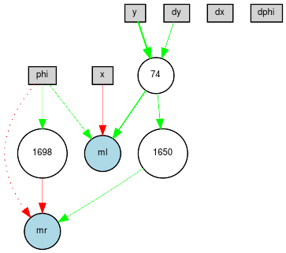

# Evolving a neural controller

Like some other [researchers](https://openai.com/blog/evolution-strategies/), I have switched focus recently
from Deep Reinforcement Learning (DRL) to Evolution Strategies (ES).  Current work, with Washington and 
Lee undergraduate student Coletta Fuller, focuses on applying the
[NEAT](https://www.cse.unr.edu/~sushil/class/gas/papers/NEAT.pdf) algorithm to
solve tasks in the GymCopter environment.

To try this out for yourself, you should do the following:

1. Install [neat-python](https://github.com/CodeReclaimers/neat-python).  

2. Clone and install the [NEAT-Gym](https://github.com/simondlevy/NEAT-Gym) repository.

3. Run ```python3 [DIR]/neat-evolve.py config/lander2d```

where ```[DIR``` is the directory in which you put NEAT-Gym; for example:

```python3 /home/levy/NEAT-Gym/neat-evolve.py config/lander2d```

This will run neat-python using the [parallel fitness
evaluator](https://neat-python.readthedocs.io/en/latest/module_summaries.html#parallel),
so you can take advantage of all the cores on your computer.

Once evolution finishes, you can test out your evolved network by doing:

```
% python3 [DIR]/neat-test.py models/gym_copter:Lander2D-v0/<fitness>.dat
```

where ```<fitness>``` is the fitness of your evolved network.

You can also see your evolved network and the species history behind it by looking at
the PDF files in the <b>visuals</b> folder.

